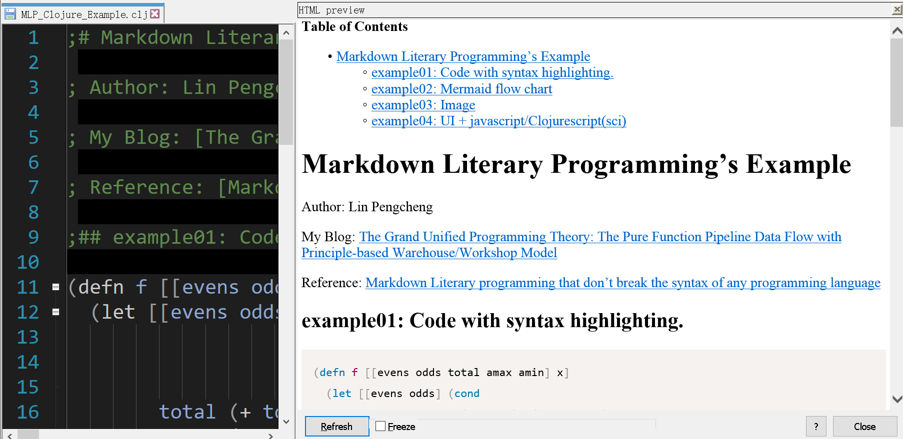

**ClojureBoxNpp**

Notepad++ patch for Clojure by: 
- Methord 01: modifying config files of Lisp. 
- Methord 02: userDefineLangs: Clojure

### Screenshots:

BracketHighlighter:

Markdown outline:

Markdown Literary Programming 01: Code with syntax highlighting

Markdown Literary Programming 02: Mermaid flow chart

Markdown Literary Programming 03: Image

Edit Clojure hiccup (HTML DSL) with live preview:

### Patch edition Method:

1. copy all files of notepad++ directory to notepad++ home directory.

2. copy Notepad++/tools/ctags/.ctags file to user home directory (c:\user\xxx).

### Config files of Clojure (userDefineLangs Clojure is Clojure, Lisp is also Clojure.) 

- Methord 01: Modify Lisp as Clojure, Lisp is also Clojure.

  * notepad++\langs.xml

  * notepad++\stylers.xml

  * notepad++\autoCompletion\lisp.xml
  
  * notepad++\functionList\Lisp.xml
  
- Methord 02: userDefineLangs: Clojure, Clojure is Clojure

  * notepad++\autoCompletion\Clojure.xml
  
  * notepad++\userDefineLangs\Clojure.xml
  
  * notepad++\functionList\Clojure.xml
  
- functionList

  * notepad++\functionList\overrideMap.xml 
  
- notepad++\tools\ctags\ .ctag (clojure config of ctags.exe and NppCCompletionPlugin.dll, copy to user home directory c:\user\xxx)

- Other: Markdown (userDefineLangs)

  * notepad++\functionList\Markdown_Monokai.xml 
  
  * notepad++\userDefineLangs\markdown_monokai.xml
  
  * Notepad++/plugins/PythonScript/scripts/Markdown_Literary_Programming_viewer.py

### Note

.ctags : clojure config of ctags.exe and NppCCompletionPlugin.dll, copy to ~ (c:\user\xxx)

### Notepad++

https://notepad-plus-plus.org/

https://github.com/notepad-plus-plus/notepad-plus-plus

### Notepad++ plugins

https://sourceforge.net/projects/npp-plugins/files/

- Clojure

  - BracketHighlighter (Only Python 2.x):

    Author: Scott Sumner,

    Notepad++/plugins/PythonScript/scripts/BracketHighlighter.py

    https://notepad-plus-plus.org/community/topic/14501/has-a-plugin-like-sublime-plugin-brackethighlighter/7

  - PythonScript(Python 2.x):
    https://github.com/bruderstein/PythonScript

  - XBrackets Lite:
    https://sourceforge.net/projects/npp-plugins/files/XBrackets%20Lite/

  - BracketsCheck: https://github.com/niccord/BracketsCheck
        
  - cli tools
    
    - NppExec: https://github.com/d0vgan/nppexec
      - notepad++\tools\clj\clj-kondo.exe --lint current-file
      - notepad++\tools\clj\babashka --file current-file
      - notepad++\tools\clj\babashka --eval selectquotedtext

    - pork2Sausage: https://github.com/npp-plugins/pork2sausage
      - notepad++\tools\clj\hiccup-cli (convert selectd HTML to Hiccup)
      - notepad++\tools\clj\babashka
        - notepad++\tools\clj\npp_convert.clj (convert selected text to ?)
  
  - Edit hiccup with live preview
    * Babashka
      * Notepad++/tools/clj/hiccup2html.clj
    * Preview HTML plugin
      * Notepad++/plugins/Config/PreviewHTML/Settings.ini
      * Notepad++/plugins/Config/PreviewHTML/Filters.ini
      
  - Markdown Literary Programming with live preview for Clojure
    * Babashka
      * Notepad++/tools/clj/mlp.clj
    * Preview HTML plugin
      * Notepad++/plugins/Config/PreviewHTML/Settings.ini
      * Notepad++/plugins/Config/PreviewHTML/Filters.ini
  
- Develop

  - Languages: https://github.com/MAPJe71/Languages
  
  - nppTagLEET: https://github.com/vinsworldcom/nppTagLEET

  - NppGTags: https://github.com/pnedev/nppgtags
 
  - LanguageHelp:
    https://github.com/francostellari/NppPlugins
  
  - NppChomeDebugPlugin: 
    https://github.com/jdubbeldam/NppChomeDebugPlugin

  - JavaScript Map Parse: 
    https://github.com/megaboich/js-map-parser/
    
  - JSTool: 
     https://github.com/sunjw/jstoolnpp
     
  - JSON-Viewer: 
    https://github.com/kapilratnani/JSON-Viewer

  - sql: http://www.scout-soft.com/sql/

  - SQLPrettyPrinter:
    https://github.com/twentyTwo/Npp.Plugins-SQLPrettyPrinter

  - npp.connections: 
    https://github.com/vladk1973/npp.connections

  - nppxmltreeview: 
    https://github.com/joaoasrosa/nppxmltreeview

  - NppGraphViz: https://github.com/jrebacz/NppGraphViz
  
  - graphviz-syntax-highlighting:
    https://github.com/signmotion/graphviz-syntax-highlighting
  
  - Excel formula: 
    http://dailydoseofexcel.com/archives/2010/09/29/formula-editor-in-notepad/

  - Compare
  
  - NppCCompletion
  
- Markdown & html & asciidoc

  - MarkdownText:
    https://github.com/NotMad-Text-Editor-Plugins/MarkdownText

  - MarkdownViewerPlusPlus: 
    https://github.com/nea/MarkdownViewerPlusPlus

  - imgtag: http://sourceforge.net/projects/imgtag/

  - HtmlTag: https://fossil.2of4.net/npp_htmltag/
  
  - WebEdit: http://downloads.sourceforge.net/project/npp-plugins/WebEdit
  
  - html preview: http://fossil.2of4.net/npp_preview/
  
  - asciidoc-highlight: 
    https://github.com/edusantana/asciidoc-highlight

  - NppSnippets
  
- Edit

  - CodeExpress (Snippets):

    https://code.google.com/archive/p/code-express/downloads

  - ElasticTabstops: https://github.com/dail8859/ElasticTabstops

  - SurroundSelection:
    https://github.com/dail8859/SurroundSelection

  - BetterMultiSelection:
    https://github.com/dail8859/BetterMultiSelection

  - selectquotedtext:
    https://www.fesevur.com/selectquotedtext/

  - NavigateTo: https://github.com/young-developer/nppNavigateTo
  
  - NewFileBrowser: https://sourceforge.net/projects/locationnav/

  - ColumnTools:
    https://github.com/vinsworldcom/nppColumnTools

  - ViSimulator: https://github.com/bycn82/visimulator

- Search

  - NppQuickSearchPanel: https://github.com/nex3z/NppQuickSearchPanel

  - Regex Trainer:
    https://github.com/ahmoylaw/RegexTrainer-Descriptions

- Sys

  - explorer: https://github.com/prekageo/npp-explorer
  
- Themes

  - VS2012-Dark: https://github.com/SeanCline/Npp-VS2012-Dark

  - TwoDark: https://github.com/RobU23/NotepadPlusPlus

- Others

  - CustomizeToolbar:

  - TextFX: https://sourceforge.net/projects/npp-plugins/files/TextFX/
    
  - QrCode: https://github.com/vladk1973/NppQrCode
  
  - MathPad
  
  - anmX: http://www.semelinanno.com/downloads/anmxnpp/anmXNpp_Page.html

  - calc: http://sourceforge.net/projects/nppcalc/

  - ToolBucket: https://github.com/phdesign/NppToolBucket/

  - TopMost: https://sites.google.com/site/fstellari/nppplugins

  - translate: https://sourceforge.net/projects/npptranslate/

